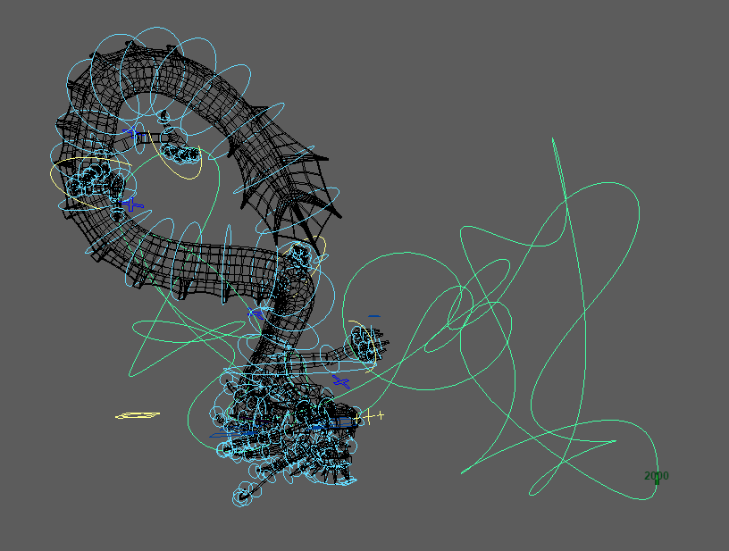

# Winding Circle Generator

A Python script for generating customizable, organic, randomly winding closed circles in Autodesk Maya. Perfect for creating natural-looking paths, rollercoaster-like trails, or artistic curves.

## Features

- **Customizable Parameters**:
  - Radius (range: `1` to `5000`, default: `1000`)
  - Winding frequency
  - Irregularity (scaled from `0` to `100`, affects randomness in radius)
  - Vertical irregularity (up-and-down distortion)
  - Number of points for smoothness control
  - Random seed for reproducibility
- **User-Friendly Interface**: A simple Maya UI with sliders and text fields to adjust parameters dynamically.
- **Live Update Mode**: Enables real-time modifications when adjusting parameters via sliders or typing values manually.
- **Input Validation**: Ensures that typed values conform to allowed ranges, automatically correcting invalid inputs.
- **Delete Previous Curve Option**: Allows users to decide whether to remove the previous curve before generating a new one.
- **Flatten Curve Ends Toggle**: Option to reposition the first and last points of the curve to `y=0`, ensuring a flat start and end.
- **Reset Button**: Quickly restores all parameters to default values.

## Installation

1. Clone this repository or download the script:
   ```bash
   git clone https://github.com/hsuehyt/WindingCircle.git
   ```
2. Open Autodesk Maya.
3. Open the Script Editor (found in the bottom right corner).
4. Paste the script from `winding_circle.py` into the Python tab and execute it.

## Usage

1. Run the script in Maya's Script Editor.
2. A UI window will appear with adjustable sliders and input fields for:
   - **Radius**: The overall size of the circle (default: `1000`, max: `5000`).
   - **Winding**: The number of loops or twists in the circle.
   - **Irregularity**: Random distortion in the radius for an organic look.
   - **Vertical Irregularity**: Up-and-down randomness along the Y-axis.
   - **Number of Points**: Controls the resolution of the generated curve.
   - **Seed**: Ensures repeatable randomness.
   - **Delete Previous Curve**: Whether to remove the previous curve before generating a new one.
   - **Live Update**: Enables dynamic updates when modifying parameters.
   - **Flatten Curve Ends**: Ensures that the first and last points are positioned at `y=0`.
3. Adjust the sliders or type values into input fields, and click **Create** to generate the winding circle.
4. Click **Reset** to restore default settings.

## Parameters Explained

- **Radius**: Controls the size of the circle (range: `1` to `5000`).
- **Winding**: The number of full loops around the circle.
- **Irregularity**: Adds randomness to the circle's radius for an organic shape (range: `0` to `100`).
- **Vertical Irregularity**: Adds randomness to the vertical movement for undulations.
- **Number of Points**: Controls the curve smoothness by increasing or decreasing the resolution.
- **Seed**: A random seed for predictable, repeatable results.
- **Live Update**: Enables automatic updates as values are changed.
- **Delete Previous Curve**: Removes the previous curve when generating a new one.
- **Flatten Curve Ends**: Forces the first and last points of the curve to `y=0`, creating a flat start and end.

## Example

```python
create_winding_circle(radius=1000, winding=7, irregularity=50, vertical_irregularity=0.4, num_points=200, seed=123, delete_previous=True, flatten_ends=True)
```

This generates a winding circle with:
- Radius = `1000`
- 7 twists around the circle
- 200 points for smoothness
- Random distortions in radius and height for a natural look.
- Start and end points flattened to `y=0`.

## Preview



## License

This project is licensed under the MIT License. See the [LICENSE](LICENSE) file for details.

## Contributing

Contributions are welcome! Feel free to fork the repository and submit pull requests.

